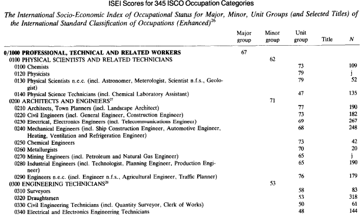

# Presentación de la clase

## Contenidos  

En esta clase se realiza un recorrido por los siguientes contenidos:

1. Operacionalización del concepto de clase social  
2. Enfoques empíricos de clases sociales  
3. Operacionalización paso a paso 
4. Operacionalización automática  
5. Unidades de análisis


# Las clases en la computadora

## Operacionalizando el concepto de clase  

- Operacionalización: pasaje de conceptos teórico-abstractos a indicadores empíricos  
- Las clases sociales son una parte de la **estructura social**  
  - El proceso de operacionalización nos permite separarla del resto de las dimensiones  


## ¿Clases, grupos o estratos?  

- Ambigüedad de los conceptos  
- Cada concepto corresponde a una tradición teórica  
- Criterios para la construcción de clasificaciones:  
  - *Elección de medidas*: medidas continuas o categóricas  
  - *Naturaleza de la información*: subjetiva u objetiva  
  - *Objeto de la medición*: estatus, clases, prestigio, etc.  
  
# Enfoques empíricos de clases  

## Enfoque EGP  

```{r fig.cap= "Derivación del esquema de clases EGP. Fuente: Erikson y Goldthorpe (1992)", fig.align='center', out.width = '85%', echo=FALSE}
knitr::include_graphics("imagenes/esquema_egp.png")
```


## Enfoque Wright

```{r fig.cap= "Tipología de las posiciones de clase en la sociedad capitalista. Wright (1994)", fig.align='center', out.width = '85%', echo=FALSE}
knitr::include_graphics("imagenes/wright1.png")
```


## Enfoques gradacionales - Escala SIOPS 

```{r fig.cap= "Puntajes estandard ordenados de 20 ocupaciones seleccionadas a partir de la escala SIOPS. Treiman(1977)", fig.align='center', out.width = '50%', echo=FALSE}
knitr::include_graphics("imagenes/treiman.png")
```

## Enfoques gradacionales - Escala ISEI 

```{r fig.cap= "Puntajes del ISEI de las primeras ocupaciones de la CIUO. Ganzeboom, Treiman y de Graaf (1992)", fig.align='center', out.width = '85%', echo=FALSE}

```


## Enfoques nacionales - Germani  

```{r fig.cap= "Esquema de clases de Gino Germani (Germani, 1955)", fig.align='center', out.width = '50%', echo=FALSE}
knitr::include_graphics("imagenes/germani.jpg")
```


## Enfoques nacionales - Torrado 

```{r fig.cap= "Evolución de la estructura de clases. Total país 1947-1991. Torrado (2007)", fig.align='center', out.width = '55%', echo=FALSE}
knitr::include_graphics("imagenes/torrado4.png")
```


# Unidades de análisis  

## Discusión teórica - metodológica  

- Siempre debe basarse en el marco teórico y los objetivos de la investigación  
- ¿Población ocupada, PEA o población total?  
- ¿Individuos u hogares?  
- Enfoques para el estudio de los hogares  
  1. Tradicional: jefe/a de hogar  
  2. Dominancia: el cónyuge de mayor nivel ocupacional define la clase del hogar  
  3. Clases híbridas: posición de ambos cónyuges  
  
