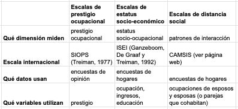

# Presentación de la clase

## Contenidos 

En esta clase se realiza un recorrido por los siguientes contenidos:

1. Formas de medir la estratificación: las escalas
2. Condiciones de vida y su aplicación
3. Mapeo de clases sociales y su aplicación
4. Debate sobre el curso: presentación de ideas de lxs estudiantes

## Escalas

```{r fig.cap= "Cuadro comparativo de diferentes escalas", fig.align='center', out.width = '85%', echo=FALSE}

```
